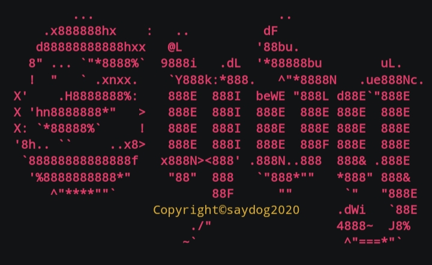
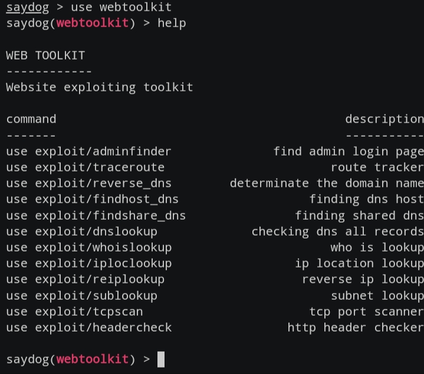
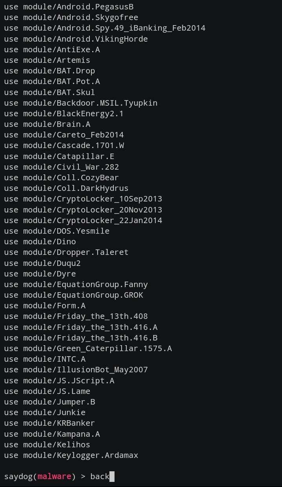
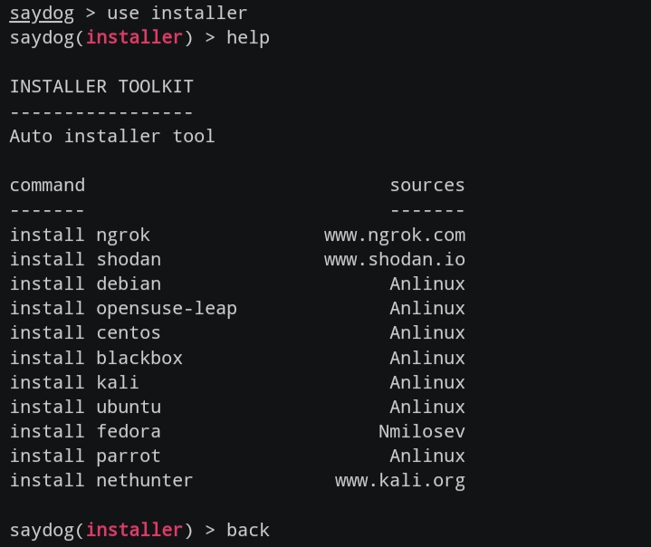
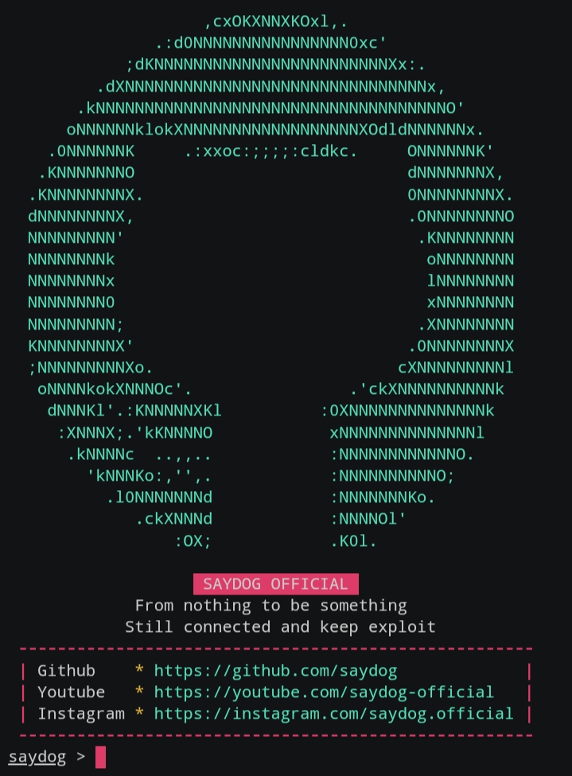

<H1 align="center">
SAYDOG FRAMEWORK
</H1>
<H4 align="center">
just a tool for exploit social media, the website also has a wordlist generator tool, malware and other hacking tools on saydog framework
</H4>

 

Coded by by <a href="https://instagram.com/iqbalmh18">Iqbalmh18</a>

  

  <a>  PYTOOLKIT  </a>
  

  <a>  WEBTOOLKIT  </a>
  

  <a>  SOCIALBRUTE  </a>
  

  <a>  MALWARE  </a>
  

  <a>  INSTALLER  </a>
  

  <a>  OTHERS  </a>
  

  <a>  AUTHOR  </a>
  

## Features

| Name                               | Status             | Information                                        |
| ---------------------------------- | ------------------ | -------------------------------------------------- |
| Port scanner                       | :white_check_mark: | Scanning open port                                 |
| Banner grabber                     | :white_check_mark: | Grabbing banner                                    |
| File grabber                       | :white_check_mark: | Grabbing file or target data                       |
| Mini crypto locker                 | :white_check_mark: | Auto encrypt path file target with pass            |
| Terabyte attack                    | :white_check_mark: | Just auto copying file 10MB to 1TB                 |
| Admin finder                       | :white_check_mark: | Finding admin login page                           |
| Route tracking                     | :white_check_mark: | Tracking route                                     |
| Reverse DNS                        | :white_check_mark: | Determinate the domain name with ip address        |
| Find host DNS                      | :white_check_mark: | Finding host DNS                                   |
| Find shared DNS                    | :white_check_mark: | Finding shared DNS                                 |
| DNS lookup                         | :white_check_mark: | Checking DNS all records                           |
| Whois lookup                       | :white_check_mark: | Checking information DNS from whois                |
| Ip location lookup                 | :white_check_mark: | Checking IP location all records                   |
| Reverse ip lookup                  | :white_check_mark: | Determinate IP with domain name                    |
| Subnet lookup                      | :white_check_mark: | Checking subnet information                        |
| Tcp scanner                        | :white_check_mark: | Scanning tcp open port                             |
| Header checker                     | :white_check_mark: | Checking http headers                              |
| Bruteforce instagram               | :white_check_mark: | Brute force attack instagram account               |
| Bruteforce facebook                | :white_check_mark: | Brute force attack facebook account                |
| Bruteforce gmail                   | :white_check_mark: | Brute force attack gmail account                   |
| Wordlist generator                 | :white_check_mark: | Generate wordlist for brute force                  |
| Malware generator                  | :white_check_mark: | Generate malwares android, windows, mac, linux     |

## Version

Version 1.2 :

    https://youtube.com/saydog-official

## Installation
Termux :

    $ git clone https://github.com/saydog/Saydog-framework
    $ cd Saydog-framework
    $ chmod +x install.sh
    $ ./install.sh

## Usage
Run :

    $ saydog

Or  :

    $ ./run

## Disclaimer

This is an open source for everyone, you may redistribute, modify, use patents and use privately without any obligation to redistribute. but it should be noted to include the source code of the library that was modified (not the source code of the entire program), include the license, include the original copyright of the author (warifp), and include any changes made (if modified). Users do not have the right to sue the creator when there is damage to the software or even demand if there is a problem caused by the makers of this tool. because every risk is caused by the user risk it self.
Hatur nuhun 😊
